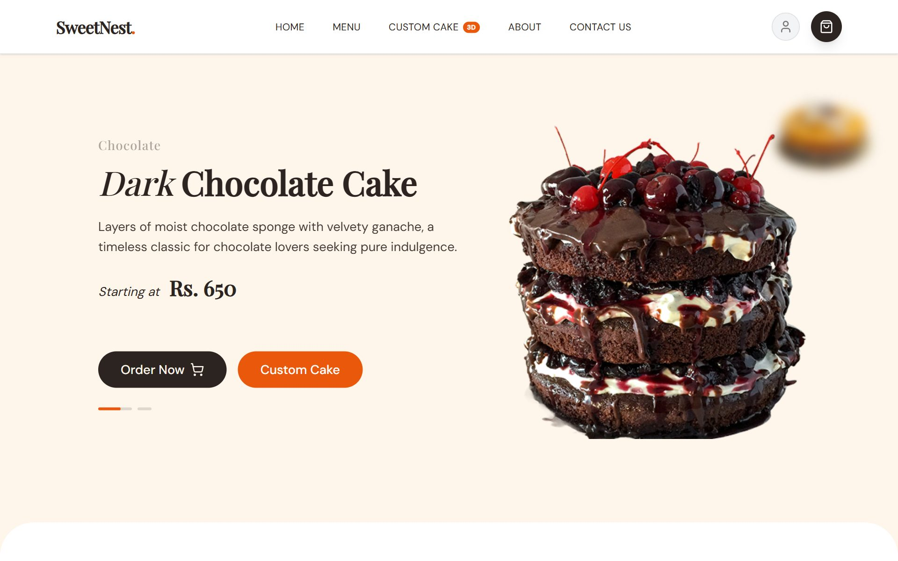
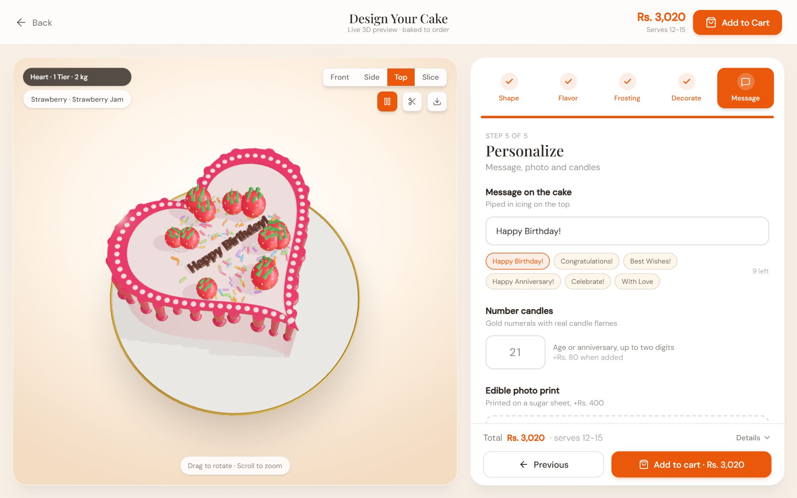
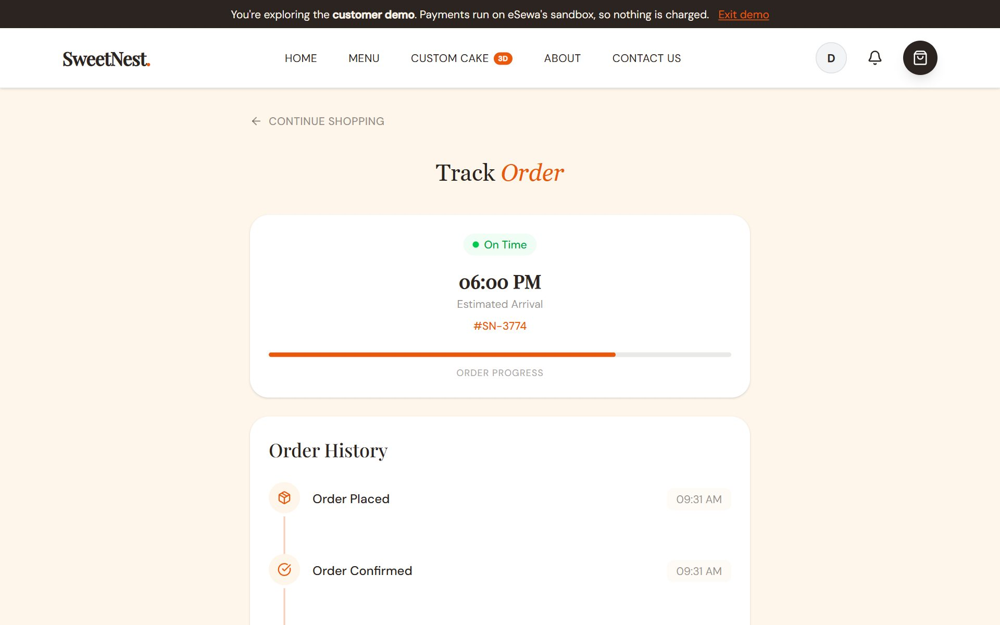
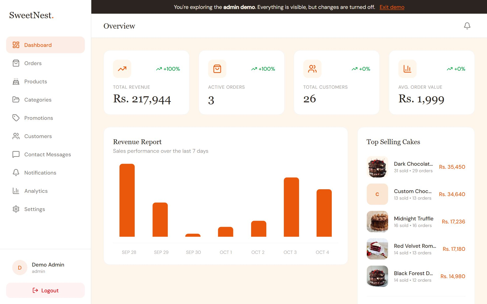
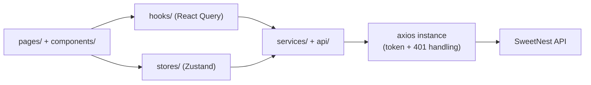

# 🍰 SweetNest Frontend

[](https://github.com/AaryanBasnet/SweetNestFrontend/actions/workflows/ci.yml)


A custom-cake bakery storefront where customers browse cakes, **design their own cake in a live 3D preview**, pay with eSewa and track delivery, backed by a full admin dashboard.

**Live site: [sweetnest.aaryanbasnet.com.np](https://sweetnest.aaryanbasnet.com.np)** · Backend: [SweetNestBackend](https://github.com/AaryanBasnet/SweetNestBackend)

> **Try it without signing up.** The login page has one-click **Customer demo** and **Admin demo** buttons. The admin demo is read-only (enforced by the API, not just the UI). Checkout runs on eSewa's sandbox, so no real money moves: eSewa ID `9806800001`, password `Nepal@123`, MPIN `1122`, token `123456`.

<p align="center"></p>

| Storefront | 3D cake designer |
|---|---|
|  |  |
| **Order tracking** | **Admin dashboard** |
|  |  |

### Highlights

- **3D cake designer** built with React Three Fiber: shape, tiers, weight, sponge, filling, frosting, drip, toppers and an iced message, with live pricing.
- **One-click demo accounts** so reviewers can try both the shop and the admin side in seconds.
- **Production details:**
  - Route-level code splitting.
  - React Query caching.
  - Error boundary with optional Sentry.
  - SEO metadata, link previews, `robots.txt` and a sitemap.
  - WebP images (about 3.2 MB down to 211 KB).
- **Tested in CI** on every push (65 tests), with the production build checked too.

### Lighthouse

Measured on the production build of the home page (October 2026):

| | Performance | Accessibility | Best practices | SEO |
|---|---|---|---|---|
| Desktop | 98 | 89 | 96 | 100 |
| Mobile | 72 | 96 | 96 | 100 |

This repository contains **only the frontend codebase**. The backend lives in a separate repository and communicates via REST APIs.

---

## ✨ Overview

The frontend focuses on:

* A polished customer shopping experience
* Advanced cake customization flows
* High-performance state and server data handling
* Clean UI animations and responsive design

Built with modern React tooling, the app is optimized for maintainability and real-world production use.

---

## 🛠 Tech Stack

* **React 19** (Vite)
* **Zustand** – global client state
* **TanStack React Query** – server state & caching
* **Tailwind CSS** – utility-first styling
* **Framer Motion** – UI animations & transitions
* **Three.js / React Three Fiber** – 3D cake visuals
* **Formik + Yup** – form handling & validation
* **React Router DOM** – routing & layouts

---

## 🚀 Features

### Customer-Facing Features

* User authentication flows (login, register, reset password)
* Browse cakes with search & filters
* Interactive cake customization (size, toppings, colors, message)
* Shopping cart with guest & authenticated user support
* Wishlist management
* Sweet Points loyalty rewards UI
* Promo codes & discounts
* eSewa payment flow integration
* Order tracking & order history
* Reviews & ratings UI
* Push-style notification UI

### UI / UX Highlights

* Responsive, mobile-first layout
* Smooth micro-interactions using Framer Motion
* Modular, reusable component architecture
* Optimistic UI updates with React Query

---

## 📁 Project Structure

```bash
SweetNestFrontend/
├── src/
│   ├── api/            # API service layer
│   ├── components/     # Reusable UI components
│   ├── pages/          # Page-level components
│   ├── routers/        # Route configuration
│   ├── layouts/        # Layout wrappers
│   ├── stores/         # Zustand stores
│   ├── hooks/          # Custom hooks
│   ├── services/       # Request wrappers used by the hooks
│   ├── schemas/        # Yup form validation
│   ├── lib/            # Third-party setup (Sentry)
│   ├── utils/          # Helper utilities
│   └── main.jsx
├── public/
├── package.json
└── vite.config.js
```

---

## ⚙️ Setup & Installation

### Prerequisites

* Node.js **v16+**
* Backend API running (separate repository)

---

### Installation

```bash
npm install
```

Start the development server:

```bash
npm run dev
```

The app will be available at:

```
http://localhost:5173
```

---

## 🔌 Environment Variables

Create a `.env` file in the root of the frontend project:

```env
VITE_API_BASE_URL=http://localhost:5000
```

Adjust the URL based on your backend deployment.

---

## 📜 Available Scripts

| Command           | Description              |
| ----------------- | ------------------------ |
| `npm run dev`     | Start development server |
| `npm run build`   | Build for production     |
| `npm run preview` | Preview production build |
| `npm run lint`    | Run ESLint               |
| `npm test`        | Run the test suite       |
| `npm run test:watch` | Re-run tests on change |
| `npm run test:coverage` | Tests with coverage |

---

## 🧪 Testing

**Vitest + React Testing Library**, running in a jsdom environment.

```bash
npm test              # run once
npm run test:watch    # re-run on change
npm run test:coverage # with a coverage report
```

**55 tests** covering:

* `stores/cartStore` – subtotal, shipping, promo discounts, the zero floor
* `stores/authStore` – login/register success and failure, logout, id
  normalisation
* `api/api` – the axios interceptors: token attachment, FormData handling,
  401 sign-out, and the cases that must **not** sign the user out
* `routers/` – `ProtectedRoute` and `AdminRoute` guards
* `ErrorBoundary` – that a render crash shows a fallback with a way out,
  rather than a blank page

Note the cart tests assert the **client's** view of the total. The server
recomputes every price independently and is the only figure a payment ever
uses - the client number is for display.

Coverage is scoped to the logic layer (stores, api, routers, utils) rather
than every component, so the number reflects what is actually under test.
Component and page tests are the next area to pick up.

---

## 🐳 Running with Docker

```bash
docker compose up --build
```

Serves the production build on http://localhost:8080. The API runs from the
backend repo's own compose file.

A Vite app compiles to static files, so the shipped image is **nginx serving a
folder, not a Node server** - about 84MB instead of ~400MB, with a whole
runtime removed from the attack surface.

Two things worth knowing:

* **`VITE_` variables are baked in at BUILD time**, not read at runtime. They
  end up readable in the shipped JavaScript, so none of them may ever be a
  secret, and changing one requires a rebuild:
  `docker build --build-arg VITE_API_BASE_URL=https://api.example.com/api .`
* **`try_files` in nginx.conf is what makes deep links work.** React Router
  handles `/menu` and `/checkout` in the browser - those paths are not files.
  Without it, a hard refresh or a pasted link to any route other than `/`
  returns a 404 from nginx.

nginx gotcha documented in `nginx.conf`: `add_header` directives are inherited
from the enclosing block **only if the current block defines none of its own**.
A single `add_header` in a `location` silently discards every header inherited
from `server` - which is how a site ships with no security headers despite
them being declared.

---

## 🧭 Architecture and decisions



### Two kinds of state, kept apart

- **Server data** (cakes, orders, analytics, reviews) lives in **React Query**, which owns caching, loading and error states. Defaults are one retry and a 5-minute `staleTime`, so moving between pages doesn't refetch what was just loaded.
- **Client state** (session, cart, checkout progress, UI) lives in small **Zustand** stores. `auth`, `cart` and `checkout` persist to `localStorage`, and each one chooses what to persist with `partialize`: the auth store keeps only the user and token, the checkout store keeps the step and order reference but not transient flags.

Server data never goes in a store and client state never goes in a query. When a bug appears, it's clear which side to look at.

### The cart works for guests and for logged-in users

A logged-out visitor's cart is kept in `localStorage`. After login it is synced to the server and merged with any custom cakes designed in the 3D builder. Orders are priced by the server when they are created, so the totals the browser shows are for display and editing `localStorage` can't change what an order costs.

### One place for requests

All HTTP goes through one axios instance (`src/api/api.js`) that attaches the token and handles auth failures in a single place. A `401` clears the session and returns the user to the login page, but only when the request actually carried a token. An anonymous request to a protected endpoint (for example the header's notification poll) used to bounce logged-out visitors off public pages, and that distinction fixed it.

### Admin and demo access are enforced by the API

`ProtectedRoute` and `AdminRoute` decide what to render, but they are a convenience, not security. The server checks the token and role on every request. That matters for the demo: the one-click **Admin demo** is read-only, and the backend also hides every real customer from it, so hiding buttons in the UI is not what makes it safe. The UI only reads `isDemo` to show a banner telling the visitor they are in a demo.

### Performance choices

- Every page is a route-level `lazy()` import behind one `Suspense` fallback, so the 3D designer's code is only downloaded on `/custompage`.
- Images are WebP, sized for where they appear (the home page's images went from about 3.2 MB to 211 KB).
- Lighthouse numbers are above, measured on the production build.

### Failing visibly

- An app-wide error boundary replaces a white screen with a recovery page, and the 3D designer has its own boundary.
- Sentry is opt-in through `VITE_SENTRY_DSN`. A DSN only lets a client *send* events, which is why it's safe in a public bundle.
- Pages set their own `<title>` per route, so tabs and link previews say something useful.

### Tests and CI

65 Vitest tests cover the stores (cart, auth), the axios interceptors, the error boundary, the admin route guard and the home page. CI runs the tests and a production build on every PR, and lints only the files a PR changed (see below), so old lint debt can't block new work while new code is still held to the rules.

### Known gaps

- The token is kept in `localStorage`, which is simple but readable by any script on the page. An `httpOnly` cookie is the stronger option and would need backend changes.
- Many older components are still plain JavaScript with no prop types or TypeScript.
- There are no end-to-end tests yet. Playwright covering browse → design → checkout would be the next addition.
- Lint still has a backlog in older files.

---

## 🛡️ Error boundary

`ErrorBoundary` wraps the whole app in `main.jsx`. React unmounts the entire
component tree when a render throws and nothing catches it, leaving the user on
a blank white page - previously only the cake configurator had a boundary, so a
render error anywhere else blanked the site.

What a boundary cannot catch, because React cannot: errors inside event
handlers, async code, or the boundary itself.

---

## 🚨 Error tracking

**Sentry**, entirely opt-in. With no `VITE_SENTRY_DSN` set the SDK is never
initialised and every call is a no-op.

A crash in the browser is invisible by default - the user sees a blank page,
closes the tab, and you never hear about it. This makes those visible.

A Sentry DSN is safe to expose publicly (it only permits sending events, not
reading them), which is why it is acceptable in a `VITE_` variable. No other
secret is.

---

## 🔄 Continuous Integration

`.github/workflows/ci.yml` runs on every push to `main` and every pull
request:

* **Test** – the Vitest suite with coverage
* **Build** – a production build, and prints the bundle size breakdown to the
  run summary
* **Lint** – on pull requests, lints **only the files the PR changes**
* **Audit** – fails on any high or critical dependency advisory

### Why lint only changed files

The codebase currently carries ~81 pre-existing lint errors across 44 files
(unused variables, plus the React Compiler rules introduced in
`eslint-plugin-react-hooks` v7). Making those a required check today would
mean every pull request starts red - and a check that is always red gets
ignored, which is worse than having no check.

Gating changed files means new and edited code must be clean, so the backlog
shrinks as the app is worked on. Swap it for a plain `npm run lint` once the
count reaches zero.

---

## 🧪 Development Notes

* Server state is handled via **React Query** with caching and invalidation
* Global UI and auth state lives in **Zustand**
* Forms use **Formik + Yup** for consistency
* Animations are isolated to UI components for maintainability

---

## 🔗 Related Repositories

* **SweetNest Backend** – Express, MongoDB, Payments, Auth (separate repo)

---

## 📄 License

This project is **proprietary software**. All rights reserved.
